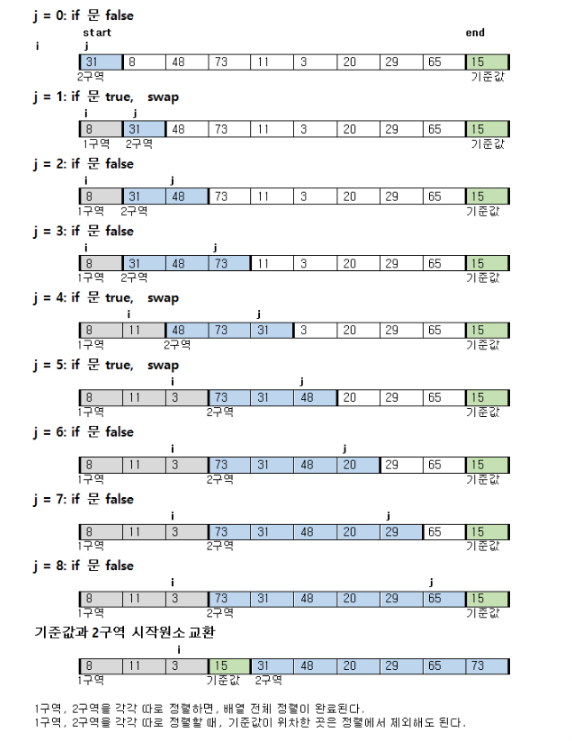

# 정렬
* Selection Sort (선택 정렬)
* Bubble Sort (버블 정렬)
* Insertion Sort (삽입 정렬)
* Merge Sort (병합 정렬)
* Quick Sort (퀵 정렬)

---

## Selection Sort (선택 정렬)
1. 가장 작은 값을 찾아 0 위치에 놓습니다.
2. 그 다음 작은 값을 찾아 1 위치에 놓습니다.
3. 그 다음 작은 값을 찾아 2 위치에 놓습니다.

```
for (int i = 0; i < a.length - 1; ++i) {
    배열 a의 i부터 끝까지 최소값을 찾습니다.
    최소값과 i 위치의 값을 서로 swap 합니다.
}
```
* 마지막 단계에서 남은 값이 1개입니다.
* 이때 최소값을 찾는 것의 의미가 없으므로 <code>i < a.length - 1</code>입니다.
* 시간 복잡도: O(n^2)
* 공간 복잡도: O(n)
* [SelectionSort Code](/src/com/study/sort/selection/SelectionSort.java)

---

## Bubble Sort (버블 정렬)
1. 0 ~ (i - 1) 까지, 두 쌍의 값을 비교하여 왼쪽 값이 크면 서로 위치를 바꿉니다.
2. (1)번 단계를 거치면 0 ~ i 까지의 최대 값이 i 위치에 있게 됩니다.
3. 0 ~ (i - 2) 까지, 두 쌍의 값을 비교하여 왼쪽 값이 크면 서로 위치를 바꿉니다.
4. (3)번 단계를 거치면 0 ~ (i - 1) 까지의 최대 값이 (i - 1) 위치에 있게 됩니다.

```
for (int i = a.length - 1; i >= 1; --i) {
    for (int j = 0; j < i; ++j) {
        if (a[j] > a[j+1]) {
            swap(a, j, j+1);
        }
    }
}
```
* 시간 복잡도: O(n^2)
* 공간 복잡도: O(n)
* [BubbleSort Code](/src/com/study/sort/bubble/BubbleSort.java)

---

## Insertion Sort (삽입 정렬)
* 삽입 정렬은 두 번째 인덱스부터 시작합니다.

```
for (int i = 1; i < a.length; ++i) {
    int value = a[i];
    
    a 배열의 0에서 (i - 1) 사이에서 value보다 큰 값들을
    뒤로 한 칸씩 이동하고, 그 값들 앞에 value를 넣습니다.
}
```
* 시간 복잡도: O(n^2)
* 공간 복잡도: O(n)
* [InsertionSort Code](/src/com/study/sort/insertion/InsertionSort.java)

---

## MergeSort (병합 정렬)
* merge 메소드의 수행 시간은 O(n)입니다.
* mergeSort 메소드는 배열을 1/2로 나누고, 나뉜 배열 각각에 대해 mergeSort를 재귀 호출합니다.
* 따라서 재귀 호출 횟수는 logN입니다.
* 그러므로 mergeSort 메소드의 시간 복잡도는 O(Nlog N)입니다.
* 공간복잡도: O(n)
* [MergeSort Code](/src/com/study/sort/merge/MergeSort.java)

---

## Quick Sort (퀵 정렬)
* 퀵 정렬의 partition 메소드의 수행 시간은 O(n)입니다.
* quickSort 메소드의 재귀 호출 횟수는 대략 O(log N)입니다.
* 따라서, quickSort 메소드의 수행 시간은 O(Nlog N)입니다.
* [QuickSort Code](/src/com/study/sort/quick/QuickSort.java)



### Best Case
* partition 메소드가 배열을 정확히 1/2로 나눈다면 재귀 호출 횟수는 log N 이고,
* quickSort 메소드의 수행 시간은 O(Nlog N) 입니다.

### Worst Case
* partition 메소드가 배열을 0 : n-1 크기로 나눈다면 재귀 호출 횟수는 n 입니다.
    > 재귀 호출에서 기준값은 제외되기 때문에 0 : n 이 아니라 0 : n-1 입니다.
* quickSort 메소드의 worst case 수행 시간은 O(N^2) 입니다.

### 메모리 공간
* quickSort, partition 메소드가 사용하는 메모리 공간은 O(1) 입니다.

## Quick Sort 와 Merge Sort 비교
* 병합 정렬의 수행 시간은 언제나 O(Nlog N) 입니다.
* 병합 정렬의 메모리 요구량은 언제나 O(N) 입니다.
* 퀵 정렬의 수행 시간 평균은 O(Nlog N) 이지만, 최악의 경우 O(N^2) 입니다.
* 그렇지만 최악의 경우는 극히 드뭅니다.
* 퀵 정렬의 메모리 요구량은 O(1) 입니다.
* 위와 같은 장단점 때문에, 실무에서는 주로 퀵 정렬을 사용합니다.